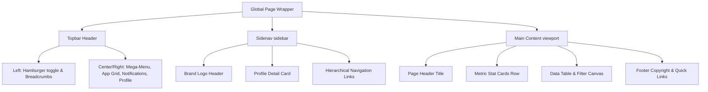

# Enterprise K'Fe Design Specification

This design specification is derived from a meticulous analysis of the **Paces - Multipurpose Tailwind CSS & Bootstrap Admin Dashboard Template** by Coderthemes. It maps the visual standards, color tokens, layout hierarchy, and component interfaces to our high-performance, decoupled Multi-Tenant Enterprise K'Fe system (Nuxt 3+, Tailwind CSS 4+, and PrimeVue).

---

## 1. Core Visual Philosophy
Our design standards reflect **"Operational Clarity, High Density, and Premium Aesthetics."** The K'Fe balances data-rich density (critical for accounting, payroll, and stock management) with modern UI elegance:
*   **Harmonious Accents:** A dynamic palette of sub-brand colors based on modern HSL tokens.
*   **Depth & Glassmorphic Surfaces:** Extensive use of background filters, soft backdrops (`backdrop-blur-md`), and layered card shadows.
*   **Tactile Feedback:** Gentle hover expansions (`scale-102`), soft shadow shifts, and dynamic border transitions.
*   **High-Density Focus:** Standard layouts feature clean, structural grids, optimized vertical padding, and a dark-mode first design to minimize screen fatigue.

---

## 2. Global Styling & Color System
The color scheme is designed to scale dynamically for multi-tenant setups, mapping colors to responsive CSS variables (`--color-primary`, `--color-secondary`, etc.).

### 2.1 Theme Palette Matrix
| Color Variable | Hex Code / Tailwind Equivalent | Role & Application |
| :--- | :--- | :--- |
| **Primary (Electric Indigo)** | `#3b82f6` / `blue-500` | Accent color, buttons, active menu states, main icons |
| **Primary Subtle** | `rgba(59, 130, 246, 0.1)` | Badges, hover states, card backdrops |
| **Secondary (Cool Gray)** | `#64748b` / `slate-500` | Subtitle text, inactive borders, secondary badges |
| **Secondary Subtle** | `rgba(100, 116, 139, 0.1)` | Grid borders, secondary card widgets |
| **Success (Emerald Green)** | `#10b981` / `emerald-500` | Active listings, positive metrics, published states |
| **Success Subtle** | `rgba(16, 185, 129, 0.1)` | Soft success badges, trending indicators |
| **Warning (Amber Orange)** | `#f59e0b` / `amber-500` | Pending states, critical stock alerts, rating stars |
| **Warning Subtle** | `rgba(245, 158, 11, 0.1)` | Pending badges, soft warnings |
| **Danger (Crimson Red)** | `#ef4444` / `red-500` | Out of stock states, negative trend metrics, delete actions |
| **Danger Subtle** | `rgba(239, 68, 68, 0.1)` | Out of stock badges, destructive buttons |
| **Info (Sky Blue)** | `#0ea5e9` / `sky-500` | Dynamic counts, customer tracking, help tips |
| **Info Subtle** | `rgba(14, 165, 233, 0.1)` | Soft info badges, customer avatars |

### 2.2 Surface Elevation & Mode Styling
```css
/* Base Surface Variables */
:root {
  /* Light Mode Surface */
  --bg-layout: #f8fafc;        /* Slate 50 */
  --bg-card: #ffffff;
  --border-color: #e2e8f0;    /* Slate 200 */
  --text-heading: #0f172a;    /* Slate 900 */
  --text-body: #475569;       /* Slate 600 */
  --shadow-sm: 0 1px 2px 0 rgba(0, 0, 0, 0.05);
  --shadow-md: 0 4px 6px -1px rgba(0, 0, 0, 0.1), 0 2px 4px -2px rgba(0, 0, 0, 0.1);
}

[data-bs-theme="dark"] {
  /* Dark Mode Surface */
  --bg-layout: #0b0f19;       /* Ultra-deep obsidian navy */
  --bg-card: #121824;         /* Rich Slate 900 surface */
  --border-color: #1e293b;    /* Slate 800 */
  --text-heading: #f8fafc;    /* Slate 50 */
  --text-body: #94a3b8;       /* Slate 400 */
  --shadow-sm: 0 1px 2px 0 rgba(0, 0, 0, 0.5);
  --shadow-md: 0 10px 15px -3px rgba(0, 0, 0, 0.3), 0 4px 6px -4px rgba(0, 0, 0, 0.3);
}
```

---

## 3. Typographical Hierarchy
We utilize **Outfit** for modern high-contrast titles and **Inter** for robust, highly-legible interface layout:
*   **Headers & Titles (Outfit):**
    *   Page Main Titles: `H4` / `1.125rem` (`18px`), Font Weight `600` (Semibold), leading-tight.
    *   Section Subtitles / Card Headers: `H5` / `0.9375rem` (`15px`), Font Weight `500` (Medium).
*   **Body & UI Metadata (Inter):**
    *   Standard Text: `body-sm` / `0.875rem` (`14px`), Font Weight `400` (Regular).
    *   Sub-labels / Brand Names: `text-xs` / `0.75rem` (`12px`), Font Weight `400`.
    *   Badges / Sorting Caps: `text-xxs` / `0.6875rem` (`11px`), Font Weight `600`, Uppercase, tracking-wider.
*   **Monospace Figures (JetBrains Mono):**
    *   Applied to stock codes (SKU), currency amounts, counts, and date timestamps (`text-sm`, `tracking-tight`).

---

## 4. Main Shell Structure & Layout Components



### 4.1 Topbar Header Details
A high-density top interface stretching 100% width with a soft border separator (`border-bottom`). It contains:
1.  **Sidebar Toggle:** A floating circular action icon using Lucide `ti-menu-2` / `ti-menu-4` to expand/collapse the sidenav dynamically.
2.  **Mega Menu Dropdown:** An expandable visual board category index:
    *   **Categories:** Dashboards & Analytics, Project Management, User Management.
    *   **Banner Widget:** A colorful graphic panel highlighting active user session features ("Welcome Back David", upgrade prompt, premium themes).
3.  **Apps Grid (9-Grid Selector):** Dropdown menu with soft rounded logos representing quick integrations (Figma, GitHub, Slack, Dropbox, etc.).
4.  **Instant Theme Toggle:** Toggles system light/dark/system mode dynamically, rendering immediate SVG asset swaps.
5.  **Notifications Hub:** Badged bell icon displaying "+7 New". Shows grouped user notifications with interactive media avatars (e.g. comment details, build statuses).
6.  **Monochrome Control & Language Selector:** Custom country flag switches supporting English, Spanish, German, French, Italian, and Chinese.
7.  **Profile Center Dropdown:** Displays user avatar with green online status marker. Exposes:
    *   *My Profile, Chat Messages, Account Settings, Support FAQ, Lock Screen, Sign Out.*

### 4.2 Sidebar Sidenav Menu Details
A fixed-width sidebar spanning `260px` in standard desktop view, collapsing to a minimized icon-only state (`70px`).
*   **Dynamic Brand Logos:** Contains double brand representations (automatic switches for dark/light layouts).
*   **Sidenav Profile Card:** Inline visual component containing a rounded user portrait, name, and subtitle role details ("David Dev", "Art Director"), facilitating rapid identity confirmation.
*   **Navigational Groups:**
    *   *Main:* Dashboards (Ecommerce, Analytics, CRM, Finance, Projects).
    *   *Apps:* Decoupled operational modules including **Ecommerce** (Products, Grid, Orders, Inventory, Refunds, Reviews), CRM, Tasks, Invoices, HRM, and Support Center.
    *   *Base Elements:* Hierarchical indices for components (Modals, Grids, Alerts), Forms (Validation, Wizards, Editors), and custom advanced tables.

---

## 5. Frontend Decoupled Nuxt/PrimeVue Integration
To keep this theme pixel-perfect in our Vue 3 + TypeScript architecture, follow these rules:

1.  **Tailwind Utility Standards:**
    *   Use Tailwind CSS `@apply` patterns within single-file components.
    *   Prefer Tailwind standard variables over hardcoded colors to maintain multi-tenant dynamically injected branding:
        ```html
        <!-- Example Badge Component -->
        <span class="inline-flex items-center gap-1.5 px-2 py-1 text-xxs font-semibold rounded bg-success-subtle text-success">
          <i class="ti ti-circle-filled text-[6px]"></i>
          Published
        </span>
        ```
2.  **PrimeVue Component Mapping:**
    *   Map the Product list Table to PrimeVue's `<DataTable>` with styling overrides using `pt` (Pass Through) properties.
    *   Replace standard form elements with PrimeVue's `<InputText>`, `<Select>` (Dropdown), and `<Button>` styled matching Paces visual specification.
3.  **Dynamic Sidenav Configurations:**
    *   Render the navigational drawer dynamically utilizing Pinia configuration matrices to support multi-tenant modular capability mapping.

---

## 6. SEO Meta Configurations
For index-facing pages (public tenant landing panels, product detail displays):
*   **Meta Framework:** Injected via Nuxt `useHead`:
    ```typescript
    useHead({
      title: 'Enterprise K\'Fe - Product Catalog Manager',
      meta: [
        { name: 'description', content: 'Configure, audit, and analyze your multi-tenant enterprise inventory with full security, database isolation, and detailed operational tracking.' }
      ]
    })
    ```
*   **Heading Structure:** Enforced single `<h1>` tag inside page scopes to optimize search crawler indexing index layouts.
