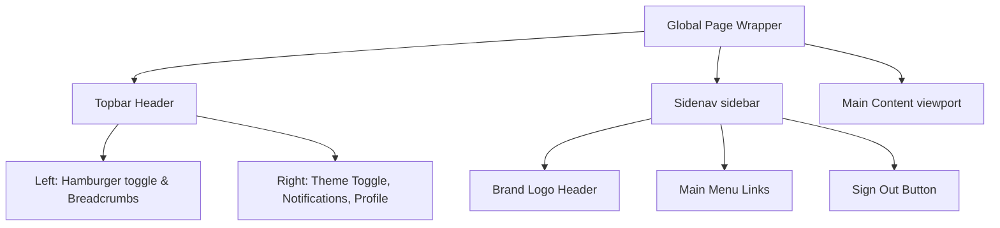

# K'Fe SecBot Design Specification

This design specification maps the visual standards, color tokens, layout hierarchy, and component interfaces to our high-performance K'Fe SecBot dashboard system (Nuxt 4+, Tailwind CSS 4+, and PrimeVue).

---

## 1. Core Visual Philosophy
Our design standards reflect **"Operational Clarity, High Density, and Premium Aesthetics."** The SecBot dashboard balances data-rich density (critical for security monitoring, keyword engines, and user violations) with modern UI elegance:
*   **Harmonious Accents:** A dynamic palette of sub-brand colors with warm glowing gold and neon green accents.
*   **Depth & Glassmorphic Surfaces:** Use of background filters, soft backdrops (`backdrop-blur-md`), and translucent dark surfaces.
*   **High-Density Focus:** Standard layouts feature clean, structural grids, optimized vertical padding, and a dark-mode first design to minimize screen fatigue.

---

## 2. Global Styling & Color System
The color scheme is designed to scale dynamically, mapping colors to responsive CSS variables tailored for dark mode first:

### 2.1 Theme Palette Matrix
| Color Variable | Base Hex Code | Role & Application |
| :--- | :--- | :--- |
| **Primary (Warm Gold)** | `#E58F24` | Accent color, buttons, active menu states, main icons |
| **Primary Light** | `#FFB74D` | Hover states, card backdrops |
| **Secondary (Neon Green)** | `#22C55E` | Active states, positive metrics |
| **Secondary Light** | `#4ADE80` | Soft success badges |
| **Danger / Violations** | `red-500` / `var(--color-danger)` | User violations, critical alerts, destructive actions |
| **Danger Subtle** | `rgba(239, 68, 68, 0.1)` | Soft warning badges, delete button hovers |

### 2.2 Surface Elevation & Mode Styling
```css
/* Base Surface Variables (From main.css & default.vue) */
:root {
  /* Layout & Surfaces (Deep Dark Glassmorphic) */
  --color-bg-app: #0F0D0C; /* Deep sophisticated dark */
  --color-bg-surface: rgba(30, 28, 26, 0.6); /* Translucent dark surface */
  --color-bg-surface-solid: #1A1816;
  --color-border: rgba(255, 255, 255, 0.08); /* Crisp translucent white */
  
  /* Additional UI state variables */
  --bg-layout: var(--color-bg-app);
  --bg-card: var(--color-bg-surface-solid);
  --text-heading: #F3F4F6;
  --text-body: #F3F4F6;
  --text-muted: #9CA3AF;
  --border-color: var(--color-border);
}
```

---

## 3. Typographical Hierarchy
We utilize **Poppins** and **Kantumruy Pro** (for Khmer/Latin support) for robust, highly-legible interface layout:
*   **Headers & Titles (Poppins):**
    *   Page Main Titles: Font Weight `600` (Semibold) to `800` (Extra Bold), leading-tight.
    *   Section Subtitles / Card Headers: Font Weight `500` (Medium).
*   **Body & UI Metadata:**
    *   Standard Text: `text-sm` or `text-base`, Font Weight `400` (Regular).
    *   Sub-labels / Brand Names: `text-xs`, Font Weight `400`.
    *   Badges / Sorting Caps: `text-xxs`, Font Weight `600`, Uppercase, tracking-wider.

---

## 4. Main Shell Structure & Layout Components



### 4.1 Topbar Header Details
A high-density top interface stretching 100% width with a soft border separator. It contains:
1.  **Sidebar Toggle:** A floating circular action icon using Tabler `IconMenu2` to expand/collapse the sidenav dynamically on mobile.
2.  **Breadcrumbs:** Displays current route context (e.g., "BotControl > Dashboard").
3.  **Instant Theme Toggle:** Toggles system light/dark mode dynamically (`IconSun` / `IconMoon`).
4.  **Notifications Hub:** Badged bell icon displaying active alerts (ping animation for new alerts).
5.  **Profile Center:** Displays user avatar (e.g., Admin User) with role subtitle.

### 4.2 Sidebar Sidenav Menu Details
A fixed-width sidebar spanning `260px` in standard desktop view, collapsing to a hidden state on mobile.
*   **Brand Logo Header:** Contains the K'Fe SecBot shield logo and bold title.
*   **Navigational Groups (Main Menu):**
    *   *Dashboard:* Overview of bot metrics and security status.
    *   *Keyword Engine:* Management of detected keywords and blocked patterns.
    *   *User Violations:* Tracking and auditing of user infractions.
*   **Footer Actions:** Sign Out button styled with danger hover transitions.

---

## 5. Frontend Decoupled Nuxt/PrimeVue Integration
To keep this theme pixel-perfect in our Vue 3 + TypeScript architecture:

1.  **Tailwind 4.0 Utility Standards:**
    *   Utilize new Tailwind CSS v4 arbitrary value syntax where appropriate, e.g., `bg-(--bg-layout)`, `text-(--text-muted)`.
    *   Prefer Tailwind standard variables over hardcoded colors to maintain dynamic theming capabilities.
2.  **PrimeVue Component Mapping:**
    *   Map data lists to PrimeVue's `<DataTable>` with styling overrides using preset configurations (e.g., Aura preset in `nuxt.config.ts`).
    *   Utilize PrimeVue's accessible and rich form components.
3.  **Icons:**
    *   Use `@tabler/icons-vue` for crisp, consistent scalable vector graphics across the dashboard.

---

## 6. SEO Meta Configurations
For index-facing pages:
*   **Meta Framework:** Injected via Nuxt `useHead`:
    ```typescript
    useHead({
      title: 'K\'Fe SecBot - Security Dashboard',
      meta: [
        { name: 'description', content: 'Monitor user violations, manage keyword engines, and oversee bot security metrics in real-time.' }
      ]
    })
    ```
