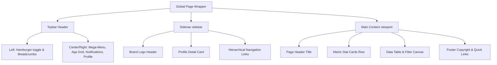

# Enterprise ERP Design Specification

This design specification is derived from a meticulous analysis of the **Paces - Multipurpose Tailwind CSS & Bootstrap Admin Dashboard Template** by Coderthemes. It maps the visual standards, color tokens, layout hierarchy, and component interfaces to our high-performance, decoupled Multi-Tenant Enterprise ERP system (Nuxt 3+, Tailwind CSS 4+, and PrimeVue).

---

## 1. Core Visual Philosophy
Our design standards reflect **"Operational Clarity, High Density, and Premium Aesthetics."** The ERP balances data-rich density (critical for accounting, payroll, and stock management) with modern UI elegance:
*   **Harmonious Accents:** A dynamic palette of sub-brand colors based on modern HSL tokens.
*   **Depth & Glassmorphic Surfaces:** Extensive use of background filters, soft backdrops (`backdrop-blur-md`), and layered card shadows.
*   **Tactile Feedback:** Gentle hover expansions (`scale-102`), soft shadow shifts, and dynamic border transitions.
*   **High-Density Focus:** Standard layouts feature clean, structural grids, optimized vertical padding, and a dark-mode first design to minimize screen fatigue.

---

## 2. Global Styling & Color System
The color scheme is designed to scale dynamically for multi-tenant setups, mapping colors to responsive CSS variables (`--color-primary`, `--color-secondary`, etc.).

### 2.1 Theme Palette Matrix
| Color Variable | Hex Code / Tailwind Equivalent | Role & Application |
| :--- | :--- | :--- |
| **Primary (Electric Indigo)** | `#3b82f6` / `blue-500` | Accent color, buttons, active menu states, main icons |
| **Primary Subtle** | `rgba(59, 130, 246, 0.1)` | Badges, hover states, card backdrops |
| **Secondary (Cool Gray)** | `#64748b` / `slate-500` | Subtitle text, inactive borders, secondary badges |
| **Secondary Subtle** | `rgba(100, 116, 139, 0.1)` | Grid borders, secondary card widgets |
| **Success (Emerald Green)** | `#10b981` / `emerald-500` | Active listings, positive metrics, published states |
| **Success Subtle** | `rgba(16, 185, 129, 0.1)` | Soft success badges, trending indicators |
| **Warning (Amber Orange)** | `#f59e0b` / `amber-500` | Pending states, critical stock alerts, rating stars |
| **Warning Subtle** | `rgba(245, 158, 11, 0.1)` | Pending badges, soft warnings |
| **Danger (Crimson Red)** | `#ef4444` / `red-500` | Out of stock states, negative trend metrics, delete actions |
| **Danger Subtle** | `rgba(239, 68, 68, 0.1)` | Out of stock badges, destructive buttons |
| **Info (Sky Blue)** | `#0ea5e9` / `sky-500` | Dynamic counts, customer tracking, help tips |
| **Info Subtle** | `rgba(14, 165, 233, 0.1)` | Soft info badges, customer avatars |

### 2.2 Surface Elevation & Mode Styling
```css
/* Base Surface Variables */
:root {
  /* Light Mode Surface */
  --bg-layout: #f8fafc;        /* Slate 50 */
  --bg-card: #ffffff;
  --border-color: #e2e8f0;    /* Slate 200 */
  --text-heading: #0f172a;    /* Slate 900 */
  --text-body: #475569;       /* Slate 600 */
  --shadow-sm: 0 1px 2px 0 rgba(0, 0, 0, 0.05);
  --shadow-md: 0 4px 6px -1px rgba(0, 0, 0, 0.1), 0 2px 4px -2px rgba(0, 0, 0, 0.1);
}

[data-bs-theme="dark"] {
  /* Dark Mode Surface */
  --bg-layout: #0b0f19;       /* Ultra-deep obsidian navy */
  --bg-card: #121824;         /* Rich Slate 900 surface */
  --border-color: #1e293b;    /* Slate 800 */
  --text-heading: #f8fafc;    /* Slate 50 */
  --text-body: #94a3b8;       /* Slate 400 */
  --shadow-sm: 0 1px 2px 0 rgba(0, 0, 0, 0.5);
  --shadow-md: 0 10px 15px -3px rgba(0, 0, 0, 0.3), 0 4px 6px -4px rgba(0, 0, 0, 0.3);
}
```

---

## 3. Typographical Hierarchy
We utilize **Outfit** for modern high-contrast titles and **Inter** for robust, highly-legible interface layout:
*   **Headers & Titles (Outfit):**
    *   Page Main Titles: `H4` / `1.125rem` (`18px`), Font Weight `600` (Semibold), leading-tight.
    *   Section Subtitles / Card Headers: `H5` / `0.9375rem` (`15px`), Font Weight `500` (Medium).
*   **Body & UI Metadata (Inter):**
    *   Standard Text: `body-sm` / `0.875rem` (`14px`), Font Weight `400` (Regular).
    *   Sub-labels / Brand Names: `text-xs` / `0.75rem` (`12px`), Font Weight `400`.
    *   Badges / Sorting Caps: `text-xxs` / `0.6875rem` (`11px`), Font Weight `600`, Uppercase, tracking-wider.
*   **Monospace Figures (JetBrains Mono):**
    *   Applied to stock codes (SKU), currency amounts, counts, and date timestamps (`text-sm`, `tracking-tight`).

---

## 4. Main Shell Structure & Layout Components



### 4.1 Topbar Header Details
A high-density top interface stretching 100% width with a soft border separator (`border-bottom`). It contains:
1.  **Sidebar Toggle:** A floating circular action icon using Lucide `ti-menu-2` / `ti-menu-4` to expand/collapse the sidenav dynamically.
2.  **Mega Menu Dropdown:** An expandable visual board category index:
    *   **Categories:** Dashboards & Analytics, Project Management, User Management.
    *   **Banner Widget:** A colorful graphic panel highlighting active user session features ("Welcome Back David", upgrade prompt, premium themes).
3.  **Apps Grid (9-Grid Selector):** Dropdown menu with soft rounded logos representing quick integrations (Figma, GitHub, Slack, Dropbox, etc.).
4.  **Instant Theme Toggle:** Toggles system light/dark/system mode dynamically, rendering immediate SVG asset swaps.
5.  **Notifications Hub:** Badged bell icon displaying "+7 New". Shows grouped user notifications with interactive media avatars (e.g. comment details, build statuses).
6.  **Monochrome Control & Language Selector:** Custom country flag switches supporting English, Spanish, German, French, Italian, and Chinese.
7.  **Profile Center Dropdown:** Displays user avatar with green online status marker. Exposes:
    *   *My Profile, Chat Messages, Account Settings, Support FAQ, Lock Screen, Sign Out.*

### 4.2 Sidebar Sidenav Menu Details
A fixed-width sidebar spanning `260px` in standard desktop view, collapsing to a minimized icon-only state (`70px`).
*   **Dynamic Brand Logos:** Contains double brand representations (automatic switches for dark/light layouts).
*   **Sidenav Profile Card:** Inline visual component containing a rounded user portrait, name, and subtitle role details ("David Dev", "Art Director"), facilitating rapid identity confirmation.
*   **Navigational Groups:**
    *   *Main:* Dashboards (Ecommerce, Analytics, CRM, Finance, Projects).
    *   *Apps:* Decoupled operational modules including **Ecommerce** (Products, Grid, Orders, Inventory, Refunds, Reviews), CRM, Tasks, Invoices, HRM, and Support Center.
    *   *Base Elements:* Hierarchical indices for components (Modals, Grids, Alerts), Forms (Validation, Wizards, Editors), and custom advanced tables.

---

## 5. Feature View: Product Management Canvas
This primary modular workspace leverages structural grids to layout critical e-commerce inventories.

### 5.1 Quick Metrics Row (5-Column Responsive Grid)
Five highly-scannable card components layout key system metrics:
1.  **Products Card (Primary subtle):** Total product count `2,240` (Active Listings: `980`). Dynamic badge `+24 New` (Success color). Accent circle containing `ti-package`.
2.  **Orders Card (Secondary subtle):** Customer order metric `8,014` (Total Orders: `105K`). Badge `+120 New`. Accent circle containing `ti-shopping-cart`.
3.  **Sales Card (Success subtle):** Today's revenue calculation `$17,854.22` (Today's Sales: `$156K`). Badge `+8.2%`. Accent circle containing `ti-currency-dollar`.
4.  **Customers Card (Info subtle):** Active client count `3,209` (Total Customers: `58,320`). Badge `+36 New`. Accent circle containing `ti-users`.
5.  **Revenue Card (Warning subtle):** Total gross margins `$3.50M` (Total Revenue: `$12.8M`). Badge `-4.5%` (Danger badge style). Accent circle containing `ti-chart-bar`.

### 5.2 Filter, Search & Actions Toolbar
A horizontal toolbar panel allowing seamless inventory control:
*   **Search Box:** Embedded prefix icon search input ("Search product name...").
*   **Multi-Filter Matrix:** Three clean inline select drop-downs:
    *   *Category Filter:* Incorporates tag icon (`ti-tag`). Exposes Electronics, Fashion, Home, Sports, Beauty.
    *   *Status Filter:* Incorporates activity icon (`ti-activity`). Exposes Published, Pending, Out of Stock.
    *   *Price Range Filter:* Incorporates currency icon (`ti-currency-dollar`). Exposes $0-$50, $51-$150, $151-$500, $500+.
*   **View Toggle:** Dual icon toggle button (Grid Category vs List Check representation).
*   **Primary Action Button:** Standalone bold red button (`btn-danger`) incorporating `ti-plus` for instant operational redirects ("Add Product").

### 5.3 High-Density Inventory Data Table
A modern, structural borderless list designed with absolute alignment:
*   **Header Sorting:** Standard metadata categories containing tiny SVGs indicating ascend/descend click status.
*   **Check-box Control:** High contrast border selector mapping dynamic selection parameters.
*   **Product Visual Avatar:** A detailed multi-item cell containing:
    *   A clean, rounded asset preview box (`48px` x `48px`).
    *   Bold product title (`text-heading`, link styled).
    *   A secondary subtitle detailing the supplier/vendor ("by: Brand name").
*   **Operational Columns:** Includes SKU, Category tags, clean numeric figures for Stock and Pricing, and interactive star graphics representing total customer ratings.
*   **Badges:** Uses curved, desaturated soft elements (`badge-soft-*` in light mode, high contrast solid in dark mode).
*   **Row Interactions:** Hover states apply transparent backdrops (`bg-slate-500/5`), softening active columns.
*   **Row Actions:** A single kebab trigger (`ti-dots-vertical`) opens a fixed-positioned dropdown — see §14 for the canonical pattern. The earlier "inline icon strip" affordance is deprecated and must not be reintroduced.

---

## 6. Advanced Customizer Canvas (Offcanvas Menu)
A dynamic drawer sliding from the screen right margin allowing quick, custom client overrides:
1.  **Skin Selectors (24 custom theme cards):** Render visual configurations adjusting overall visual schemes (Prism, Minimalist, Vivid, Retro, Neon, Oblique, etc.).
2.  **Color Scheme Schemes:** Enforces light/dark overrides or aligns settings to the system layout.
3.  **Topbar & Sidenav Color Tuning:** Sets navbar properties to Light, Dark, Gray, or customizable color gradients.

---

## 7. Frontend Decoupled Nuxt/PrimeVue Integration
To keep this theme pixel-perfect in our Vue 3 + TypeScript architecture, follow these rules:

1.  **Tailwind Utility Standards:**
    *   Use Tailwind CSS `@apply` patterns within single-file components.
    *   Prefer Tailwind standard variables over hardcoded colors to maintain multi-tenant dynamically injected branding:
        ```html
        <!-- Example Badge Component -->
        <span class="inline-flex items-center gap-1.5 px-2 py-1 text-xxs font-semibold rounded bg-success-subtle text-success">
          <i class="ti ti-circle-filled text-[6px]"></i>
          Published
        </span>
        ```
2.  **PrimeVue Component Mapping:**
    *   Map the Product list Table to PrimeVue's `<DataTable>` with styling overrides using `pt` (Pass Through) properties.
    *   Replace standard form elements with PrimeVue's `<InputText>`, `<Select>` (Dropdown), and `<Button>` styled matching Paces visual specification.
3.  **Dynamic Sidenav Configurations:**
    *   Render the navigational drawer dynamically utilizing Pinia configuration matrices to support multi-tenant modular capability mapping.

---

## 8. SEO Meta Configurations
For index-facing pages (public tenant landing panels, product detail displays):
*   **Meta Framework:** Injected via Nuxt `useHead`:
    ```typescript
    useHead({
      title: 'Enterprise ERP - Product Catalog Manager',
      meta: [
        { name: 'description', content: 'Configure, audit, and analyze your multi-tenant enterprise inventory with full security, database isolation, and detailed operational tracking.' }
      ]
    })
    ```
*   **Heading Structure:** Enforced single `<h1>` tag inside page scopes to optimize search crawler indexing index layouts.

---

## 9. Modular Tasks Canvas Design & Animation Concept (CSS Only)

To reflect the highly premium visual aesthetic found in senior frontend development styles, the **Tasks Module** in our Multi-Tenant ERP utilizes a pure-CSS animation and color framework. This ensures smooth, GPU-accelerated micro-animations without external JS package bloat.

### 9.1 GPU-Accelerated Animation Tokens
Integrate these custom animation keyframes and properties in `frontend/assets/css/main.css` to drive high-performance task metrics, urgent alerts, and interactive states:

```css
/* Next-Gen CSS Animation Keyframes for Tasks UI */
@layer base {
  @theme inline {
    --animate-orbit: orbit var(--duration, 10s) linear infinite;
    --animate-meteor: meteor var(--duration, 5s) linear infinite;
    --animate-ripple: ripple var(--duration, 2s) ease calc(var(--i, 0) * 0.2s) infinite;
  }

  /* 1. Orbit Effect: Circular task completion loaders & chart tracks */
  @keyframes orbit {
    0% {
      transform: rotate(calc(var(--angle) * 1deg)) translateY(calc(var(--radius) * 1px)) rotate(calc(var(--angle) * -1deg));
    }
    100% {
      transform: rotate(calc(var(--angle) * 1deg + 360deg)) translateY(calc(var(--radius) * 1px)) rotate(calc((var(--angle) * -1deg) - 360deg));
    }
  }

  /* 2. Meteor Glow: Floating streak gradients inside urgent task category cards */
  @keyframes meteor {
    0% {
      transform: rotate(var(--angle)) translateX(0);
      opacity: 1;
    }
    70% {
      opacity: 1;
    }
    100% {
      transform: rotate(var(--angle)) translateX(-500px);
      opacity: 0;
    }
  }

  /* 3. Ripple Pulse: Tactile indicator dots for Overdue or High-Priority Tasks */
  @keyframes ripple {
    0%, 100% {
      transform: translate(-50%, -50%) scale(1);
    }
    50% {
      transform: translate(-50%, -50%) scale(0.9);
    }
  }
}
```

### 9.2 Tasks Visual Layout Classes
*   **High-Priority Overdue Ripple Indicator**:
    ```html
    <div class="relative w-4 h-4 flex items-center justify-center">
      <span class="absolute w-full h-full rounded-full bg-red-500/20 animate-ripple" style="--duration: 1.5s; --i: 1;"></span>
      <span class="absolute w-2 h-2 rounded-full bg-red-500"></span>
    </div>
    ```
*   **Active Orbit Loading States**:
    ```html
    <div class="relative w-12 h-12 rounded-full border border-violet-500/10 flex items-center justify-center">
      <span class="absolute animate-orbit text-violet-400" style="--angle: 0; --radius: 20;">⚡</span>
      <span class="text-xxs font-bold text-gradient">78%</span>
    </div>
    ```
*   **Premium Meteor-Background Card**:
    ```html
    <div class="relative overflow-hidden p-5 rounded-xl border border-(--border-color) bg-(--bg-secondary)/80 backdrop-blur-md">
      <!-- Floating Meteor Effect -->
      <span class="absolute top-0 right-0 h-[2px] w-[100px] bg-linear-to-r from-violet-500 to-transparent animate-meteor" style="--angle: -45deg; --duration: 3s;"></span>

      <h3 class="text-xs font-bold text-(--text-primary)">Critical Release Sprint</h3>
      <p class="text-[10px] text-(--text-secondary) mt-1">Due today at 18:00</p>
    </div>
    ```

---

## 10. Feature View: Recruitment Candidate Pipeline (Kanban Concept)

The HRM recruitment workspace renders applicants as a horizontal pipeline — one column per `ApplicationStatus`, with drag-and-drop status transitions. Reference implementation: `frontend/pages/candidates.vue`. This canvas is the canonical pattern for any future stage-based workspace (e.g. Sales O2C pipeline, Procurement RFQ board, Tasks Sprint board) — reuse the column shell, card anatomy, and signal-derivation rules below rather than reinventing them.

### 10.1 Visual Token Mapping
The original concept was authored against Material 3 surface tokens (`bg-surface-container-low`, `text-on-surface`, `text-headline-lg`, Material Symbols). Inside this codebase those translate to existing tokens — **do not introduce M3 tokens or the Material Symbols font**. The mapping below is authoritative for any pipeline-style screen:

| Mockup token (Material 3) | Use this instead | Notes |
| :--- | :--- | :--- |
| `bg-surface-container-low` / `bg-surface-container-highest` | `bg-(--bg-muted)` / `glass-card` | Column tray vs. card surface |
| `text-on-surface` / `text-on-surface-variant` | `text-(--text-heading)` / `text-(--text-muted)` | Title text vs. metadata |
| `text-headline-lg` | `text-xl font-semibold` (Outfit) | Page H1 — keep §3 hierarchy |
| `text-label-md` / `text-body-md` | `text-xxs uppercase tracking-wider` / `text-xs` | Chips/badges vs. card body |
| `bg-primary/20 text-primary` (active toggle) | `bg-(--color-primary-subtle) text-(--color-primary)` | Selected segmented-control item |
| `bg-error/20 text-error`, `bg-secondary/10 text-secondary` | `<Badge variant="danger">`, `<Badge variant="secondary">` | Always go through `components/Badge.vue` |
| `material-symbols-outlined` glyphs (`view_kanban`, `chevron_right`, `add`, `schedule`, `warning`, `link`, `person_pin`, `handshake`, `check_circle`) | Tabler equivalents (`ti-layout-kanban`, `ti-chevron-right`, `ti-plus`, `ti-clock`, `ti-alert-triangle`, `ti-link`, `ti-user-check`, `ti-handshake`, `ti-circle-check`) | Tabler font is already loaded in `nuxt.config.ts` |
| Remote candidate photo URLs | Initials avatar circle on `--color-primary-subtle` | PII / external CDN — derive from `applicantName` |

### 10.2 Column Shell
Each column is a fixed-width (`300px`) tray on `--bg-muted` with a 1px `--border-color` outline. Header is a soft-variant pill (`badge-soft-*`) keyed to the column's status so users can read the stage at a glance even without the label:

| Status | Header variant | Meaning |
| :--- | :--- | :--- |
| `applied`    | `badge-soft-secondary` | Inbound — no action taken yet |
| `screening`  | `badge-soft-info`      | HR review in progress |
| `interview`  | `badge-soft-warning`   | Active interview loop — time-sensitive |
| `offer`      | `badge-soft-primary`   | Offer extended — highest-attention column |
| `hired`      | `badge-soft-success`   | Terminal positive state |

```html
<div
  class="kanban-column flex flex-col gap-3"
  :class="{ 'kanban-column--dragover': dragOverColumn === col.status }"
  @dragover.prevent="onColumnDragOver(col.status, $event)"
  @drop="onColumnDrop(col.status)"
>
  <header class="flex items-center justify-between px-1">
    <span class="text-xxs font-bold uppercase tracking-wider px-2.5 py-1 rounded-full border"
          :class="columnHeaderClass(col.status)">
      {{ col.label }} <span class="opacity-70">({{ grouped[col.status]?.length || 0 }})</span>
    </span>
  </header>
  <!-- ...cards... -->
</div>
```

```css
.kanban-column {
  width: 300px; min-width: 300px; max-width: 300px;
  background: var(--bg-muted);
  border: 1px solid var(--border-color);
  border-radius: 14px;
  padding: 0.75rem;
}
.kanban-column--dragover {
  border-color: var(--color-primary);
  background: color-mix(in srgb, var(--color-primary-subtle) 70%, var(--bg-muted));
}
```

### 10.3 Card Anatomy
Cards are `glass-card rounded-xl p-3` with a 4-zone vertical layout. The card itself is `cursor-grab` (becomes `grabbing` on `:active`); during an active drag the source card drops to `opacity: 0.45` so the user can still see where it came from.

1. **Header row** — initials avatar (8px circle on `--color-primary-subtle`), candidate name (xs semibold), vacancy title (xxs muted), plus a contextual `<Badge>` (see §10.4).
2. **Rating row** — 5 Tabler stars (`ti-star-filled` filled in `--color-warning`, `ti-star` outline in `--border-strong`). Rating is **derived**, not stored — see §10.5.
3. **Conditional slot** — offer column shows a salary chip (`bg-(--bg-muted)` rounded box, mono font, gated on `hrm.recruitment.read`). Other columns may use this slot for stage-specific signals (e.g. interview round count, technical-tag chips).
4. **Footer row** — left: source icon + label; right: relative time (`Xh ago`, `Xd ago`). Footer flips to `text-(--color-danger)` with an `ti-alert-triangle` when the card is overdue.

### 10.4 Card Badge Resolution (Priority Order)
The header badge is computed per-card per-column. **The first match wins** — never stack badges:

1. **Urgent** (`danger`) — card is overdue per §10.6 thresholds.
2. **New** (`primary`) — in the `applied` column AND `appliedAt < 24h` ago.
3. **Referral** (`secondary`) — `referrerEmployeeId` is set.
4. **Hired** (`success`) — terminal stage marker.
5. Otherwise: no badge.

Always go through `components/Badge.vue`. To keep templates TS-narrowing-safe, return a sentinel `{ show: false, variant, label }` object rather than `null` and gate the render on `v-if="badge.show"`.

### 10.5 Star Rating Heuristic (Stateless)
Rating is **not** persisted — it's a coarse signal derived from completeness so cards in `applied`/`screening` self-rank without recruiter input:

```ts
let r = 3
if (a.coverLetter)        r += 1   // wrote a cover letter → engaged
if (a.resumePath)         r += 1   // attached a resume
if (a.referrerEmployeeId) r  = Math.min(5, r + 1)  // referrals jump to top
return Math.max(1, Math.min(5, r))
```

When the backend grows a real `recruiter_rating` column, swap the body of `rating()` for a direct read and keep the rest of the card unchanged.

### 10.6 Overdue Thresholds
Drives both the `Urgent` badge and the danger-tinted footer/ring:

| Status | Threshold (days since `appliedAt`) |
| :--- | :--- |
| `applied`, `screening` | ≥ 5 |
| `interview`, `offer`   | ≥ 7 |
| `hired`, `rejected`, `withdrawn` | never overdue (terminal) |

### 10.7 Drag-and-Drop Transitions
Native HTML5 DnD — **no `vuedraggable` or similar dependency**. The rules:

- The card sets `draggable="true"` only when (a) the user has `hrm.recruitment.write` and (b) `STATUS_FLOW[card.status]` has at least one allowed next status. Otherwise `dragstart` calls `ev.preventDefault()`.
- On `dragover`, the column checks `canDropOn(target)` against `STATUS_FLOW[draggingFrom]`. Disallowed drops set `dataTransfer.dropEffect = 'none'` so the OS cursor reflects the rejection — no error toast needed.
- On `drop`, do an **optimistic** local mutation, then `PATCH /applications/:id/status`. On error, roll back to the original status and show an inline alert. While the request is in flight, the destination column shows a tiny spinner ("Moving...") next to the count.
- Suppress the card's `click` → details-modal handler while a drag is in progress (`if (draggingId.value) return`) so dropping a card doesn't open the modal.

```ts
const STATUS_FLOW: Record<ApplicationStatus, ApplicationStatus[]> = {
  applied:   ['screening', 'rejected', 'withdrawn'],
  screening: ['interview', 'rejected', 'withdrawn'],
  interview: ['offer',     'rejected', 'withdrawn'],
  offer:     ['hired',     'rejected', 'withdrawn'],
  hired: [], rejected: [], withdrawn: []
}
```

Note: `rejected` and `withdrawn` are reachable transitions but **not rendered as columns** — they live behind an explicit row-level menu (existing pattern in `pages/applications.vue`). Keep terminal-negative outcomes off the canvas so the board reads as forward momentum.

### 10.8 Toolbar & Empty States
- **Page toolbar** uses a breadcrumb (`Recruitment › Pipeline`) above the H1, plus a Board/List segmented control on the right. The List option `NuxtLink`s to `/applications`; the inverse is wired in `applications.vue`. Keep both views; they are complementary, not alternatives.
- **Loading** uses the standard spinner pattern from §5 (centered, `border-(--color-primary)/20 border-t-(--color-primary) animate-spin`).

#### Empty-state matrix
Empty columns are **not** all rendered the same — the visual treatment encodes whether the user can do anything from that column without a drag:

| Column kind | When empty, render | Why |
| :--- | :--- | :--- |
| **Entry column** (`applied`) | Primary-tinted CTA card — see §10.8.1 | This is the only stage a user can populate without an existing record; the empty state must offer the create action directly. |
| **Intermediate / terminal columns** (`screening`, `interview`, `offer`, `hired`) | Dashed-border hint "Drop here to move to *<stage>*" | These stages can only be reached by advancing an existing card; the hint preserves the drop target and tells the user the column is alive. |
| **User lacks `*.write` permission** | Dashed-border hint (no CTA even on the entry column) | Read-only viewers should not see a button they cannot use. |

#### 10.8.1 Entry-Column CTA Card
The CTA replaces the dashed hint on the entry column. It is a primary-tinted `glass-card`-shaped button (full column width, same `rounded-xl` radius as cards) — sized and weighted so it reads as the first card the user will create, not as a floating toolbar button. Anatomy:

1. **Icon medallion** — 32×32 filled-primary circle with white `ti-user-plus` (matches the `.btn-primary` shadow recipe).
2. **Label** — `text-xs font-semibold text-(--text-heading)` (e.g. "New Application").
3. **Helper line** — `text-xxs text-(--text-muted)` one-liner describing what the action starts (e.g. "Submit a candidate to start the pipeline.").

```html
<button v-if="col.status === 'applied' && canWrite"
        type="button"
        class="kanban-cta glass-card rounded-xl p-4 w-full text-left"
        @click="openSubmitModal()">
  <span class="kanban-cta-icon"><i class="ti ti-user-plus text-base" /></span>
  <span class="block text-xs font-semibold text-(--text-heading) mt-3">New Application</span>
  <span class="block text-xxs text-(--text-muted) mt-1">
    Submit a candidate to start the pipeline.
  </span>
</button>
```

```css
.kanban-cta {
  background: linear-gradient(
    180deg,
    color-mix(in srgb, var(--color-primary-subtle) 80%, var(--bg-card)) 0%,
    var(--bg-card) 100%
  );
  border: 1px dashed rgb(var(--color-primary-rgb) / 0.4);
  box-shadow: 0 1px 2px 0 rgb(var(--color-primary-rgb) / 0.08);
  transition: transform .15s ease, border-color .15s ease, box-shadow .15s ease, background .15s ease;
}
.kanban-cta:hover {
  transform: translateY(-2px);
  border-color: var(--color-primary);
  box-shadow: 0 6px 16px -4px rgb(var(--color-primary-rgb) / 0.25);
}
.kanban-cta:focus-visible {
  outline: none;
  border-color: var(--color-primary);
  box-shadow: 0 0 0 3px rgb(var(--color-primary-rgb) / 0.2);
}
.kanban-cta-icon {
  display: inline-flex; align-items: center; justify-content: center;
  width: 32px; height: 32px; border-radius: 9999px;
  background: var(--color-primary); color: #fff;
  box-shadow: 0 4px 12px rgb(var(--color-primary-rgb) / 0.35);
}
```

Design notes:
- The dashed primary border (vs. a solid one) intentionally echoes the dashed "Drop here" hint from intermediate columns — it tells the user the slot is still a *placeholder*, just with an alternate action.
- The hover state lifts (`translateY(-2px)`) and gains a primary shadow — same tactile recipe as `.kanban-card:hover`, so cards and CTA share a feedback language.
- Keep the CTA on `--bg-card` (gradient to subtle primary at the top), **not** on a saturated `--color-primary` fill. A fully primary button would dominate the canvas and pull attention away from the actual candidate cards in other columns.

#### 10.8.2 Creation Modal Contract
Clicking the CTA opens the standard submission modal — **reuse `pages/applications.vue`'s form, do not redesign**. The contract:

- **Surface** — `glass-card rounded-2xl max-w-lg` on a `bg-black/40 backdrop-blur-sm` overlay; `@click.self` closes (clicking the form does not).
- **Form** — `form-grid` (single column on mobile, 2-column on `md:`+), with `form-grid-full` spans for the vacancy select, resume, cover letter, and referrer.
- **Required fields** — vacancy, applicant name, applicant email. The vacancy select is **pre-filled** from `route.query.vacancyId` or the active filter when present, so the CTA on a filtered board lands in the right job.
- **Submit** — POST `/applications` with `null` (not `''`) for empty optional fields. Disable the submit button while the request is in flight. On error, render `formError` inline via `.form-error` rather than alerting.
- **Post-submit** — close the modal and call `loadApplications()`; the new card appears in the Applied column on the same tick and replaces the CTA automatically.
- **Cancel during submit** — `closeSubmitModal()` must be a no-op while `saving` is true, so the user cannot orphan an in-flight POST.

This same contract applies to any future entry-column CTA (e.g. "New Lead" on a Sales pipeline, "New RFQ" on a Procurement board) — fork the styling, keep the modal/contract identical.

### 10.9 Reuse Checklist for New Pipeline Boards
Before forking this concept for another module, verify:
- [ ] The domain has a finite `status` enum with a clear forward flow (`STATUS_FLOW` map exists).
- [ ] Terminal-negative statuses can be hidden from the canvas without losing information.
- [ ] Drag transitions are atomic on the server (single PATCH, idempotent, audit-logged via `Auditable`).
- [ ] Read/write permissions are split: read-only users can see the board but cannot initiate drags.
- [ ] Card signals are derived from existing fields — do not add columns to the DB just to render a badge.

---

## 11. Feature View: File Uploading & Storage Management Design Standards

The File Uploading and Storage Management subsystem provides secure, high-performance, and audit-compliant file handling across all ERP modules. It strictly decouples storage mechanisms, enforces tenant-isolation (P0), validates file integrity, and optimizes client network performance using modern UI/UX patterns.

### 11.1 Visual Token Mapping & UI/UX Components
File upload interfaces are designed using a dense, glassmorphic layout, using PrimeVue components (e.g. `<FileUpload>`) customized via Tailwind CSS `pt` (Pass Through) tokens:

| UI Component | Styling Recipe & Tokens | UX Interaction & States |
| :--- | :--- | :--- |
| **Drag & Drop Tray** | `glass-card border-dashed border-2 border-(--border-color) hover:border-(--color-primary) transition-all p-8 flex flex-col items-center gap-3` | Active drag highlights the boundary (`border-(--color-primary) scale-101`) |
| **Upload Progress Bar** | `h-1.5 w-full bg-slate-200 dark:bg-slate-800 rounded-full overflow-hidden` with a primary gradient indicator | Smooth dynamic width expansion with speed/ETA readouts |
| **Banned Alert Toast** | `<Toast>` styled in `bg-danger-subtle text-danger border-danger/20` | Triggered immediately on client-side or backend extension rejection |
| **File Avatar Preview** | `w-10 h-10 rounded-lg bg-slate-100 dark:bg-slate-800 border border-(--border-color) flex items-center justify-center` | Displays file extension badges (e.g., PDF, DOCX) or thumbnail image pre-renders |

### 11.2 Hierarchical Directory Structure (Best Practice)
To prevent filename collisions and ensure system/module organization, all files are stored on tenant-aware scoped storage disks without manual tenant prefixing. Path resolution must strictly follow the system/module and feature hierarchy:

`storage/app/<module>/<feature>/<sub_feature_or_category>/{uuid}.{extension}`

#### Case Study Directory Layouts:
1. **Candidate Resumes (HRM recruitment system)**:
   - File Path: `storage/app/hrm/recruitment/application/resume/{uuid}.ext`
2. **General eDocuments Module**:
   - File Path: `storage/app/edocuments/documents/{uuid}.ext`
3. **CMS Module Versions**:
   - File Path: `storage/app/documents/cms/{uuid}.ext`

### 11.3 Security & Database Tracking Schema
Every upload transaction must verify binary integrity and maintain full traceability in the database.

#### Schema Specifications:
- **Binary Magic Bytes (MIME Type)**: Must be checked server-side via PHP `fileinfo` to verify the true signature, rejecting executable files (e.g. `.php`, `.py`, `.sh`, `.exe`, `.js`).
- **File Renaming**: Banish path traversal attacks (`../`) and spaces. Save to disk using a unique UUID (`Str::uuid()`) combined with the sanitized extension.
- **Integrity Checksums**: Calculate a `SHA-256` hash of every uploaded file and persist it in the database for auditing and deduplication.

### 11.4 Resume Upload Endpoint Contract (Reference)
Reference implementation: `backend/app/Tenants/Modules/HRM/Controllers/ApplicationController@storeResume` + `RecruitmentService@storeResume` + frontend `frontend/pages/hrm/applications/new.vue`.

- **Endpoint** — `POST /applications/resumes` inside `auth:api`. Multipart body field is `file`. Returns `201 { path, original_name, size, mime_type }`.
- **Validation** — use `extensions:pdf,doc,docx|max:10240` at the FormRequest layer (trusts the original client extension), and re-check MIME inside the service for defense in depth. **Do not use `mimes:` for resumes** — content-based MIME guessing rejects PDFs that browsers tag as `application/octet-stream`.
- **Custom message** — supply `'file.extensions' => 'Resume must be a PDF, DOC, or DOCX file.'` so the user never sees Laravel's auto-generated "doc, doc" output.
- **Frontend states** — track `idle | uploading | success | failed` on the picker. Surface a spinner + "Uploading to tenant storage..." line while in flight, the server-returned `path` on success, and an inline `Retry` button on failure. Block `canAdvance` / `canSubmit` while `uploading` or `failed` — the user must remove or retry first.
- **Path persistence** — the frontend stores the returned `path` into the application form's `resume_path` field; the final `POST /applications` submission carries the server-side path, never the local filename.

---

## 12. Multi-Step Wizard Canvas

Reference implementation: `frontend/pages/hrm/applications/new.vue` (Add New Candidate → Upload › Review & Edit › Finalize). This canvas is the canonical pattern for any future create-flow that benefits from progressive disclosure (e.g. "New Vacancy", "New Payroll Run", "New Project Onboarding"). Reuse the stepper, sticky footer, and split-pane structure rather than re-rolling them.

### 12.1 When to Use a Wizard vs. a Modal
| Use a wizard when | Use a modal/single-page form when |
| :--- | :--- |
| The flow has 3+ logical phases that the user can mentally separate (upload → review → confirm). | The form fits in ≤ ~15 fields and has no prerequisite step (e.g. quick-submit applications). |
| One phase produces data the next phase consumes (e.g. parsed resume → editable form). | All fields are independent. |
| A live preview / second pane is valuable on a step. | The form is purely linear. |
| The user benefits from a "you are here" map. | The user is iterating on a small change (e.g. status transition, quick edit). |

Keep both a wizard entry point (`Add candidate` primary button) **and** a quick-submit modal (`Quick submit` ghost button) on the parent list page. Power users will skip the wizard for one-off submissions; first-time users will want the guided path.

### 12.2 Page Header & Stepper
The page header is two columns at `xl:` and stacks below — H1 + step-aware subtitle on the left, the stepper on the right. The stepper uses a `step-pill` row: each pill is a 28×28 numbered bubble next to its label, separated by 1px bars. State map:

| State | Bubble | Label | Bar to next |
| :--- | :--- | :--- | :--- |
| Pending (`i > active`) | `--bg-card`, `--border-color`, `--text-muted` | `--text-muted` | `--border-color` |
| Active (`i === active`) | filled `--color-primary`, white text, primary shadow | `--color-primary` | `--border-color` |
| Done (`i < active`) | `--color-primary-subtle`, primary outline + check icon | `--color-primary` | `--color-primary` at 40% |

Only allow `canJumpTo(i)` clicks for visited or earlier steps — track `visited: Record<number, boolean>` so back-navigation works after the user moves forward, but you can't skip ahead by clicking step 3 from step 1.

### 12.3 Step Body Conventions
- **Step 1 (acquisition)** — drag-drop tray (see §11.1) + a small "skip" card linking forward; right rail carries a required-prerequisite picker (e.g. the target vacancy) plus a "Tips" card listing format/size/tenant scope.
- **Step 2 (review & edit)** — split pane on `xl:`+: a `xl:col-span-2` form on the left, a sticky `xl:sticky xl:top-20` preview pane on the right. Form is grouped into `fieldset.glass-card.rounded-2xl.p-6` sections with a `<legend>` row holding the section icon + title and a per-section action button (e.g. "Add experience"). Below `xl:` the preview drops below the form — never force a side-by-side at smaller breakpoints.
- **Step 3 (finalize)** — `<dl>` review card on the left, contextual sidebar on the right summarizing what submit will do ("Pipeline entry: Applied · Audit entry recorded · Tenant scope @handle"). The submit button lives in the footer (§12.5), not on this card — the card is read-only.

### 12.4 Step-Aware Helpers
The header subtitle is driven from a `stepHint` computed:

```ts
const stepHint = computed(() => {
  if (activeStep.value === 0) return 'Upload a resume — we parse it to pre-fill the next step.'
  if (activeStep.value === 1) return 'Verify and refine information parsed from the resume.'
  return 'Confirm the candidate and add them to the pipeline.'
})
```

Validation is centralized in `canAdvance` (per step) and `canSubmit` (terminal). Both **must** also gate on any pending async work — for the resume wizard that means `uploadState !== 'uploading' && uploadState !== 'failed'`. If a step depends on a prerequisite (e.g. step 1 needs `job_vacancy_id`), enforce it in `canAdvance` so the Next button disables — do not let the user reach step 2 and discover the requirement there.

### 12.5 Sticky Footer Navigation
A `sticky bottom-0 -mx-4 md:-mx-8 px-4 md:px-8 py-4 bg-(--header-bg) backdrop-blur-xl border-t border-(--border-color)` strip pinned to the bottom of the main slot. Layout:

| Slot | Contents |
| :--- | :--- |
| Left | `Back` (`<` ti-arrow-left) — `btn-ghost`. On step 0, replaces itself with `Back to <parent list>` as a `NuxtLink`. |
| Right (cluster) | `Discard` (text link, opens `confirm()` then routes away) + either `Next` (`btn-primary`) or `Save & Finalize` (`btn-success` with `ti-circle-check`). |

Disable everything in the cluster while `saving === true` so the user can't double-submit. On submit success, redirect to a destination that **shows the newly-created record in context** (e.g. `/candidates?vacancyId=...` so the user sees their new candidate land in the Applied column) — not back to a generic list.

### 12.6 Routing & Breadcrumb Override
Wizards always live at a nested URL (`/<parent>/new`). To avoid creating a parent-page wrapper, use `definePageMeta` on a flat filename to override the path and the breadcrumb label:

```ts
definePageMeta({
  path: '/applications/new',
  breadcrumb: 'Add Candidate'
})
```

This lets the layout's dynamic breadcrumb render `Applications › Add Candidate` (Applications linked, Add Candidate bold) without any per-page nav markup. See §13 for the breadcrumb resolver contract.

### 12.7 Reuse Checklist for New Wizards
Before forking this canvas for another module, verify:
- [ ] Each step has a meaningful name (not just "Step 2") and a one-line `stepHint`.
- [ ] `canAdvance` blocks on async work, not just on field presence.
- [ ] Step 3 is read-only — all edits happen on step 2.
- [ ] The footer's Save action redirects to a destination that shows the new record, not to a generic list.
- [ ] A "Quick submit" modal still exists on the parent list page for users who don't need the guided path.

---

## 13. Application Shell: Dynamic Breadcrumb & Sidebar Active State

Reference implementation: `frontend/layouts/default.vue`. These are layout-level contracts — every page inherits them; per-page overrides happen via `definePageMeta`.

### 13.1 Breadcrumb Resolver
The breadcrumb is **not** static text concatenated from the route path. It's a computed `breadcrumbItems: { label, to }[]` array driven by three sources, in order of precedence:

1. **`definePageMeta({ breadcrumb })`** (or `title`) on the active page — wins for the last crumb only.
2. **`SLUG_LABELS` map** in the layout — friendly labels for known route segments (`applications` → "Applications", `new` → "Add Candidate"). Keep this map curated; do not let it drift into a copy of the navigation.
3. **`titleize(slug)`** fallback — splits on `-` and title-cases each word so an unmapped slug still reads cleanly.

```ts
const SLUG_LABELS: Record<string, string> = {
  dashboard: 'Dashboard',
  applications: 'Applications',
  candidates: 'Candidates',
  new: 'Add Candidate',
  // ...
}

const breadcrumbItems = computed<Crumb[]>(() => {
  const segments = router.currentRoute.value.path.split('/').filter(Boolean)
  let trail = ''
  return segments.map((seg, i) => {
    trail += `/${seg}`
    const isLast = i === segments.length - 1
    const metaTitle = isLast
      ? (router.currentRoute.value.meta.breadcrumb as string | undefined)
        || (router.currentRoute.value.meta.title as string | undefined)
      : undefined
    return { label: metaTitle || SLUG_LABELS[seg] || titleize(seg), to: trail }
  })
})
```

Rendering rules:
- Every crumb except the last is a `NuxtLink` to its `to` (cumulative path). The last is plain text in `text-(--text-heading) font-semibold`.
- Constant ancestor crumbs (`Paces › Enterprise`) are hardcoded above the dynamic list — they aren't routes, they're brand context.
- **No per-page breadcrumb nav.** If a page renders its own `<nav>` breadcrumb above its H1, delete it — the layout's is the only one. Two breadcrumbs is a regression.

### 13.2 Sidebar Active-State (Prefix Matching)
The sidebar's active class must reflect the nested URL. Exact-match (`$route.path === item.route`) breaks the moment a feature grows a child route — `/applications/new` no longer highlights `Applications`. Replace it with a prefix matcher:

```ts
const isRouteActive = (target?: string): boolean => {
  if (!target || target === '#') return false
  const path = router.currentRoute.value.path
  return path === target || path.startsWith(target + '/')
}
```

The trailing `'/'` boundary is load-bearing — without it, `/leaves` would falsely match `/leave-types`. With it, `/applications/new` matches `/applications` (parent highlights) but `/applications-archive` does not.

Apply `isRouteActive` to **three** places, otherwise the behavior is inconsistent:
- Single-link items (`nav-link-active` class)
- Sub-link items (`nav-link-active` class)
- `isGroupActive` (parent group expand indicator)
- The on-mount auto-expand block, so landing directly on a nested URL opens its parent group.

### 13.3 Shell Reuse Checklist
Before adding a new top-level navigation item or route, verify:
- [ ] The slug is added to `SLUG_LABELS` if it differs from `titleize(slug)`.
- [ ] The deepest leaf route either has a `definePageMeta({ breadcrumb })` override or its slug is in `SLUG_LABELS`.
- [ ] Nested routes (`/foo/bar`) light up the `/foo` sidebar item.
- [ ] No page renders its own breadcrumb above the H1 — the layout owns it.

---

## 14. Data Table: Row Actions & Multi-Select Bulk Operations

Reference implementation: `frontend/pages/applications.vue`. This pattern replaces the inline-icon row buttons described in §5.3 — they don't scale past 3 actions and confuse the user about which buttons are dangerous. **Use this pattern for any list view that has ≥ 2 row-level actions or supports bulk operations.**

Adopted across the codebase (kebab dropdown is the only row-actions affordance — no inline button strips):
- `pages/applications.vue` — View · Edit · Convert to Employee · Delete (also: bulk delete + bulk convert toolbar — §14.3/§14.4).
- `pages/hrm/recruitments/vacancies.vue` — Edit · View applications · Publish (draft) · Close (open/paused) · Archive.
- `pages/employees.vue` — Edit · Email · Terminate (≠ terminated). Shared trigger between the table and the grid card.
- `pages/hrm/departments.vue` — Edit · Archive.
- `pages/hrm/positions.vue` — Edit · Remove.
- `pages/leave-types.vue` — Edit · Remove.
- `pages/leaves.vue` — Approve · Reject (when `canApprove`) · Withdraw. Trigger only renders when `status === 'pending'`.
- `pages/hrm/payroll.vue` — View payslips · Process (draft) · Close (processed).
- `pages/appraisals.vue` — Edit/view · Submit (draft) · Review (submitted) · Close (reviewed) · Archive (≠ closed).
- `pages/products.vue` — View · Edit · Delete.

### 14.1 Kebab Dropdown (Per-Row Actions)
Each row's actions cell renders exactly one trigger — a 30×30 `action-trigger` button containing `ti-dots-vertical`. Clicking it opens a fixed-positioned floating menu anchored to the trigger, auto-flipping above when there isn't room below.

```ts
const openActionMenu = (a: Application, ev: MouseEvent) => {
  const rect = (ev.currentTarget as HTMLElement).getBoundingClientRect()
  const menuWidth = 180
  const menuMaxHeight = 160
  const left = Math.min(rect.right - menuWidth, window.innerWidth - menuWidth - 8)
  const wouldOverflow = rect.bottom + menuMaxHeight + 8 > window.innerHeight
  actionMenu.app = a
  actionMenu.x = Math.max(8, left)
  actionMenu.y = wouldOverflow ? rect.top - menuMaxHeight - 6 : rect.bottom + 6
  actionMenu.open = true
}
```

Menu structure (top → bottom):
1. **View** — always shown.
2. **Edit** / other write actions — only when `canWrite`.
3. **Divider** (`<hr class="my-1 border-(--border-color)">`).
4. **Destructive actions** (Withdraw, Delete) — `action-item-danger`, only when business rules allow (e.g. only `applied`/`screening` can be withdrawn).

Behavior:
- Trigger uses `@click.stop` so document-level close doesn't immediately re-close.
- Document-level `addEventListener('click', closeActionMenu)` on mount handles outside-click dismiss.
- The opened trigger gets `action-trigger-open` (subtle primary-tint) so the user sees which row is "live".
- Menu items derive their visibility from per-row predicates (`canWithdraw(app)`) — never gray-out an inapplicable item, just don't render it.

### 14.2 Avoid Inline Action Buttons for State Transitions
**Do not** add per-row "Move" / "Advance" / status-transition buttons to a list view that also has a kanban (`/candidates`). Status transitions belong on the board where the workflow is visualized; duplicating them on the list spawns popovers and confuses the affordance.

Removed pattern (anti-pattern):
```html
<!-- ❌ Don't do this — transition lives on the kanban -->
<button @click="openTransitionMenu(a)"><i class="ti ti-arrow-right" /> Move</button>
```

### 14.3 Multi-Select Rows
The list view supports bulk operations via row checkboxes. **Selection is keyed by row id and persists across pagination and filter changes** — this lets users build up a multi-page batch. Clear the selection only after a successful bulk action.

#### Checkbox column
Both header and rows render `<input type="checkbox" class="row-checkbox">`. Disable any row whose business rules block the bulk action (e.g. only `applied`/`screening` are bulk-withdrawable) — disabled rows show a tooltip explaining why.

The header checkbox has three states driven by computed predicates:

```ts
const isSelectable = (a) => canWithdraw(a)   // mirror the single-row rule
const selectableRows = computed(() => applications.value.filter(isSelectable))
const allSelectableSelected = computed(() =>
  selectableRows.value.length > 0 &&
  selectableRows.value.every(a => selectedIds.value.has(a.id))
)
const someSelectableSelected = computed(() =>
  selectableRows.value.some(a => selectedIds.value.has(a.id))
)
```

Bind indeterminate via `:indeterminate.prop` (it is a DOM property, not an attribute):

```html
<input
  type="checkbox" class="row-checkbox"
  :checked="allSelectableSelected"
  :indeterminate.prop="someSelectableSelected && !allSelectableSelected"
  :disabled="selectableRows.length === 0"
  @change="toggleSelectAll"
>
```

Selected rows tint with `bg-(--color-primary-subtle)/30` and **suspend** the standard hover-bg so the selection state isn't overwritten on hover.

### 14.4 Bulk Action Toolbar
A horizontal strip slides in **inside** the table card (between filters/header and the table itself) when `selectedCount > 0`, using a slide+fade transition:

```css
.bulk-toolbar {
  display: flex;
  align-items: center;
  justify-content: space-between;
  padding: 0.625rem 1rem;
  background: var(--color-primary-subtle);
  border-bottom: 1px solid rgb(var(--color-primary-rgb) / 0.2);
}
.bulkbar-enter-active, .bulkbar-leave-active {
  transition: opacity 0.15s ease, max-height 0.2s ease;
  overflow: hidden;
}
.bulkbar-enter-from, .bulkbar-leave-to { opacity: 0; max-height: 0; }
```

Layout:
- **Left** — `N selected · Clear` (text-only "Clear" link that calls `clearSelection`).
- **Right** — One or more action buttons. Destructive actions use `text-(--color-danger) hover:bg-(--color-danger-subtle)`, show a spinner during the request, and disable while in flight.

The toolbar must **never** be sticky to the viewport (no `position: fixed`/`sticky`) — it belongs to the table card, not the window. Scrolling past the table makes the selection irrelevant; floating it implies otherwise.

### 14.5 Bulk Endpoint Contract
Bulk operations need a dedicated server endpoint, not parallel single requests. Parallel single requests fan out N audit log entries, can partially succeed, and waste round-trips.

```php
// POST /<resource>/bulk-delete  →  RecruitmentService@bulkDeleteApplications
public function bulkDestroy(Request $request): JsonResponse
{
    $data = $request->validate([
        'ids'   => 'required|array|min:1|max:200',
        'ids.*' => 'required|uuid|exists:<table>,id',
    ]);

    $rows = Model::whereIn('id', $data['ids'])->get();
    foreach ($rows as $row) {
        $this->authorize('delete', $row);   // per-row policy gate
    }

    $result = $this->service->bulkDelete($data['ids']);
    return response()->json($result, 200);
}
```

Service contract — must return a structured outcome, not a bare count:

```php
/**
 * @return array{deleted:int, skipped:array<int,string>, missing:array<int,string>}
 */
public function bulkDelete(array $ids): array
{
    return DB::transaction(function () use ($ids) {
        $found    = Model::whereIn('id', $ids)->get(['id', 'status']);
        $missing  = array_values(array_diff($ids, $found->pluck('id')->all()));
        $eligible = $found->filter(fn ($a) => in_array($a->status, [...], true));
        $skipped  = $found->reject(fn ($a) => in_array($a->status, [...], true))
                          ->pluck('id')->values()->all();

        $deleted = $eligible->isEmpty()
            ? 0
            : Model::whereIn('id', $eligible->pluck('id')->all())->delete();

        return compact('deleted', 'skipped', 'missing');
    });
}
```

Frontend handles the three-bucket response:

```ts
if (res.skipped?.length || res.missing?.length) {
  const parts = [`${res.deleted} withdrawn`]
  if (res.skipped?.length) parts.push(`${res.skipped.length} skipped (past screening)`)
  if (res.missing?.length) parts.push(`${res.missing.length} not found`)
  toast.info('Bulk withdraw completed', parts.join(' · '))
} else {
  toast.success('Bulk withdraw complete', `${res.deleted} application(s) withdrawn.`)
}
```

This pattern (`{ deleted, skipped, missing }`) generalizes — any bulk action that has business-rule eligibility checks should return the same shape.

### 14.6 Edit Modal Contract (List-View Editing)
The Edit action opens a modal — **do not** route to a separate `/<resource>/:id/edit` page. The modal:

- Surface: `glass-card rounded-2xl max-w-2xl max-h-[90vh] overflow-y-auto` on a `bg-black/40 backdrop-blur-sm` overlay.
- Uses the same `form-grid` shape as the create modal so the layouts read as variants of one form.
- **Locks identity-shaping fields** — for applications, the vacancy is shown but `disabled`, with a one-line hint explaining why. The status is not in the modal at all — it has its own transition flow.
- All other fields are editable and prefilled from the row. Array fields (skills) round-trip through a flat `_skillsText` reactive helper that joins on open and splits on save.
- Submit → `PUT /<resource>/{id}` → `loadList()` → close + success toast. Errors render via `.form-error` inline; do not toast validation errors.
- Cancel during save is a no-op (`if (editSaving.value) return`) — never let the user orphan an in-flight PUT.

### 14.7 Table Pattern Reuse Checklist
Before adding row actions or bulk operations to a new list:
- [ ] Row actions are consolidated into a single kebab dropdown — no inline `<button>` strips.
- [ ] Status transitions live on the canonical workflow surface (kanban / detail page), not duplicated here.
- [ ] Multi-select rows: header checkbox supports indeterminate; non-eligible rows disable rather than hide.
- [ ] The bulk endpoint returns `{ done, skipped, missing }`-shaped results and is gated per-row by the same policy as the single-row variant.
- [ ] Selection persists across page changes; clears on successful bulk completion.
- [ ] Edit happens in a modal with identity-shaping fields locked, not a separate page.

---

## 15. Confirmation Dialog (`toast.confirm`)

Reference implementation: `frontend/components/ConfirmDialog.vue` + `frontend/composables/useToast.ts` (`confirm` method) + mount in `frontend/app.vue`. **This is the canonical replacement for the browser-native `window.confirm()`.** Never use the browser primitive — it is unstyled, locks the JS thread, and clashes with the rest of the surface design.

### 15.1 API Contract
The composable exposes `confirm()` returning `Promise<boolean>`:

```ts
const ok = await toast.confirm({
  title: `Delete ${name}?`,
  description: 'This cannot be undone.',
  confirmLabel: 'Delete',          // default: 'Confirm'
  cancelLabel: 'Keep it',          // default: 'Cancel'
  color: 'danger',                 // default: 'warning'
  icon: 'ti-alert-triangle'        // default: derived from color
})
if (!ok) return
// ...perform the action
```

Resolution rules:
- **Confirm button click** → resolves `true`.
- **Cancel button click, X-corner click, backdrop click, Escape key** → resolves `false`.
- Resolution is **idempotent** — repeated clicks during the close animation settle the promise exactly once.

The promise resolving is the side-effect; the dialog removes itself from the queue at the same instant. Don't `await` more than once — store the boolean.

### 15.2 Architecture: Queue + Viewport
Confirms live in their own module-level queue (`confirms: ConfirmRequest[]`), **separate from `toasts`**. This separation matters:

- Toasts are non-blocking notifications — multiple stack in the corner.
- Confirms are blocking decisions — exactly **one** renders at a time. Subsequent `confirm()` calls queue up and render in FIFO order when the active one resolves. This prevents a second destructive dialog from sliding behind one the user just dismissed.

`ConfirmDialog.vue` is mounted **once** at the app root next to `ToastViewport`:

```vue
<!-- app.vue -->
<NuxtPage />
<ToastViewport />
<ConfirmDialog />
```

Pages never instantiate the dialog component themselves — they call `toast.confirm()` and read the resolved boolean.

### 15.3 Visual Anatomy
The dialog is **hero-first**, centered, and tonal — designed to feel purposeful, not punitive. Order from top to bottom:

| Layer | Element | Notes |
| :--- | :--- | :--- |
| 0 | Overlay | `bg: rgba(15,23,42,0.5)`, `backdrop-blur(6px) saturate(120%)`. `z-index: 110` (above any in-page modal at 50). |
| 1 | Card surface | `max-w-26rem`, `rounded-1.25rem`, `bg-(--bg-card)`, `border-(--border-color)`, `box-shadow-(--shadow-lg)`. Glassmorphic in dark mode (`backdrop-blur(16px)`). |
| 2 | Tonal wash (`::before`) | Radial gradient at top of card, `--accent` keyed to `color` at ~18–20% opacity. Subtle — it tints the dialog without overwhelming the type. |
| 3 | Corner close (`ti-x`) | Passive cancel affordance, top-right. **Not** the primary cancel — the footer is. |
| 4 | Hero icon medallion | 56×56 circle, color-keyed background (`color-mix` of `--color-{tone}-subtle` and `--bg-card`), 1.5rem icon glyph. Optional `.confirm-halo` wrapper sits behind it for an animated glow hook — leave the halo's `background` unset to keep the dialog quiet. |
| 5 | Title | 17px, semibold, `letter-spacing: -0.01em`. Sentence case, ends with `?` for confirmations. |
| 6 | Description | 13px `--text-body`, `line-height: 1.55`. Centered, capped at `max-w-22rem` so long sentences don't sprawl. |
| 7 | Action row | 2-column CSS grid (`1fr 1fr`), `gap: 0.625rem`. Cancel on the left, primary on the right. |

```html
<div class="confirm-card confirm-card--danger">
  <button class="confirm-close"><i class="ti ti-x" /></button>

  <div class="confirm-hero">
    <span class="confirm-halo" />
    <span class="confirm-icon confirm-icon--danger">
      <i class="ti ti-alert-triangle" />
    </span>
  </div>

  <div class="confirm-body">
    <h3 class="confirm-title">Delete X's application?</h3>
    <p class="confirm-description">This cannot be undone.</p>
  </div>

  <div class="confirm-actions">
    <button class="confirm-cancel">Cancel</button>
    <button class="confirm-btn confirm-btn--danger">Delete</button>
  </div>
</div>
```

### 15.4 Color Tone Mapping
The `color` field drives the tonal wash, icon medallion tint, default icon glyph, and primary button color. Choose by action semantic, not by mood:

| Color | Default icon | Use for |
| :--- | :--- | :--- |
| `danger`    | `ti-alert-triangle` | Destructive, irreversible actions: delete, drop, force-close, terminate. |
| `warning`   | `ti-help-circle`    | Reversible but consequential: archive, unpublish, mark inactive. (Default tone.) |
| `primary`   | `ti-help-circle`    | Neutral confirmation of intent: publish, send, submit-for-review. |
| `success`   | `ti-help-circle`    | Positive irreversible: approve, finalize, mark paid. |
| `info`      | `ti-help-circle`    | Informational gates: "this will queue a background job…" |
| `secondary` | `ti-help-circle`    | Last-resort fallback. Prefer a more specific tone. |

The `confirmLabel` should be the **verb of the action**, not "OK" or "Yes". "Delete", "Archive", "Publish", "Send" — never make the user re-read the title to figure out what the green button does.

Action buttons also get a colored drop-shadow (`box-shadow: 0 6px 16px -4px rgb(var(--color-{tone}-rgb) / 0.4)`) keyed to the tone — gives them tactile weight without flooding the dialog with color.

### 15.5 Accessibility & Motion
- **Focus management** — `confirm` button receives focus on open (`nextTick + .focus()`); the element focused before open is restored on close (`previouslyFocused?.focus?.()`).
- **Keyboard** — `Enter` confirms, `Escape` cancels. Both `preventDefault` so they don't trigger any handler on the underlying page.
- **Screen readers** — `role="dialog"`, `aria-modal="true"`, `aria-labelledby` → title id, `aria-describedby` → description id (when present).
- **Body scroll lock** — `document.body.style.overflow = 'hidden'` while a dialog is active, restored on close (and in `onBeforeUnmount` for safety).
- **Backdrop click** — `@click.self` on overlay routes to `onCancel`, so clicking outside the card cancels but clicking the card itself does not.
- **Motion** — card slides up 8–12px and scales `0.96 → 1` over 240ms with the `cubic-bezier(0.16, 1, 0.3, 1)` ease. Overlay fades over 180ms. Both honor `prefers-reduced-motion` — the entrance translate is dropped and any halo animation pauses.

### 15.6 When NOT to use `toast.confirm`
Confirms are friction. Use them sparingly — every one is a small "are you sure" tax on the user's day. **Skip the confirm when:**

- The action is **trivially reversible** in the same view (e.g. toggling a boolean filter, removing a tag chip you can re-add in one click). Prefer optimistic + undo-toast.
- The action is **cheap and frequent** (e.g. clicking a status badge to filter — this is interaction, not commitment).
- The user has **just typed something** (e.g. submitting a filled form). The act of typing is the consent.

**Use a confirm when:**
- The action is destructive and irreversible (`Delete`, `Drop`, `Terminate`, `Force-close`).
- The action is bulk or fan-out (deleting N rows, sending N emails, processing payroll for everyone).
- The action crosses a compliance / audit boundary (publishing a vacancy, closing a payroll period, finalizing an appraisal).
- The action is cheap to undo but expensive to land on wrong (replying-all, broadcasting to a tenant).

For **truly reversible** actions with an undo path, prefer a notification toast with an `actionLabel: 'Undo'` over a confirm — that's faster for the user and respects their default-yes intent.

### 15.7 Anti-Patterns
- ❌ **`window.confirm(...)`** — replace with `await toast.confirm(...)`. Native dialog is unstyled, blocks the JS thread, can't be themed, and can't carry the action's color/icon.
- ❌ **`window.alert(...)`** — use `toast.error/warning/info/success` for notifications. Alerts have no descriptions, no actions, no auto-dismiss, no tone.
- ❌ **`window.prompt(...)`** — never. Build a proper form modal with `form-grid` for any input flow.
- ❌ Confirming a confirm. If the user already clicked "Delete" on a row's kebab menu, the dialog is the gate; do not add an "Are you really sure?" follow-up. One gate is enough.
- ❌ Vague button labels (`OK`, `Yes`, `Continue`). The button label must restate the verb of the action so the user can confirm without re-reading the title.
- ❌ A confirm without `description` for destructive actions. Always state the consequence ("This cannot be undone.", "All N rows will be removed."). The title is the question; the description is the cost.

### 15.8 Reuse Checklist
Before adding a confirmation flow:
- [ ] Action is destructive, irreversible, bulk, or audit-bounded — not just "the user clicked something".
- [ ] `color` reflects the action's severity (danger for destructive, warning for cautionary, etc.).
- [ ] `confirmLabel` is the verb of the action ("Delete", "Archive"), not "OK" / "Yes".
- [ ] `description` states the consequence for destructive actions.
- [ ] The promise is awaited exactly once; the boolean drives whether the action proceeds.
- [ ] No native `confirm()` / `alert()` / `prompt()` calls remain in the file.
- [ ] No second confirm dialog after this one for the same flow.

